## Contenido

::: incremental
-   Mentalidad Analítica: Pensar con Datos.

-   Interpretar Datos: Ciclo Estratégico del Análisis

-   Visualización de Datos Efectiva.

-   Taller.
:::

# [Mentalidad Analítica: Pensar con Datos]{.seccion} {background-image="images/fondo_seccion.png"}

## Práctica

:::::: columns
::::: {.column width="100%"}

::: fragment
Eres el Líder de la Experiencia del Cliente en una empresa de Retail de productos de oficina y recientemente han aplicado una evaluación para medir la percepción de los clientes de un Impresor Multifuncional, así como si han recibido atención personalizada por parte de diferentes áreas.

  
:::

::: fragment
-   [Customer Experience Dashboard](https://laostat-cx-dashboard-data-stotytelling.share.connect.posit.cloud){target="_blank" title="Clic para ir"}
:::

:::::
::::::

## 👀 ¡No todos los datos sirven para el mismo tipo de decisión! {auto-animate="true" auto-animate-easing="ease-in-out"}

   

:::::::::::: columns
::::: {.column width="33%"}
:::: {.fragment fragment-index="1"}
::: {data-id="box1"}
**Operativas**

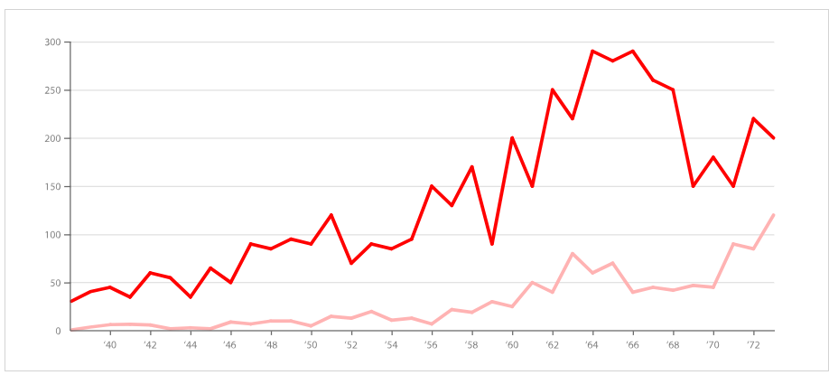{fig-align="center" width="250"}
:::
::::
:::::

::::: {.column width="33%"}
:::: {.fragment fragment-index="2"}
::: {data-id="box2"}
**Tácticas**

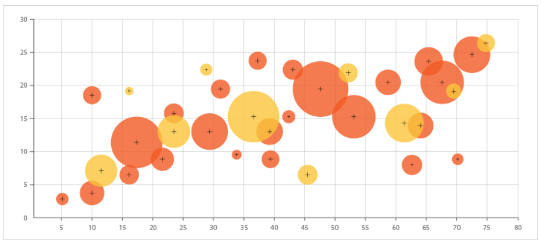{fig-align="center" width="250"}
:::
::::
:::::

::::: {.column width="33%"}
:::: {.fragment fragment-index="3"}
::: {data-id="box3"}
**Estratégicas**

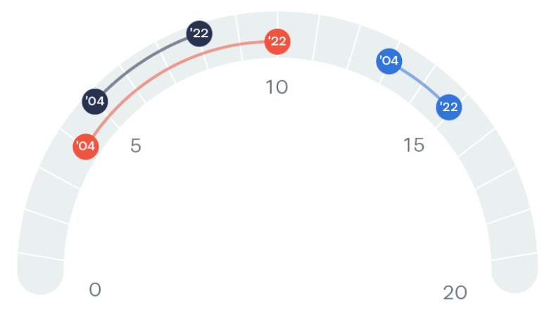{fig-align="center" width="225"}
:::
::::
:::::
::::::::::::

##  {auto-animate="true" auto-animate-easing="ease-in-out"}

:::::::::::::: columns
:::::: {.column width="20%"}
::: {data-id="box1"}
**Operativas** {fig-align="center" width="150"}
:::

::: {data-id="box2"}
**Tácticas** {fig-align="center" width="150"}
:::

::: {data-id="box3"}
**Estratégicas** {fig-align="center" width="125"}
:::
::::::

::::::::: {.column width="50%"}
:::: fragment
::: box
-   **Objetivo:** Monitorear actividades continuamente.
-   Buscan presentar datos en tiempo real o casi tiempo real.
-   **Usuarios:** Todo tipo de personal administrativo y operativo que requiere visualizar comportamiento diario.
:::
::::

:::: fragment
::: box
-   **Objetivo:** Realizar ajustes de gestión, analisis de casos.
-   Buscar analizar datos con mayor complejidad, tendencias, comparaciones, segmentaciones.
-   **Usuarios:** Jefaturas intermedias, equipos de planificación.
:::
::::

:::: fragment
::: box
-   **Objetivo:** Enfatizan en el desempeño de indicadores de gestión.
-   Enfocado en el cumplimiento de metas, KPI´s, datos macros de gestión.
-   **Usuarios:** Tomadores de decisiones de alto nivel, C-Level, Gerentes Seniors.
:::
::::
:::::::::
::::::::::::::

## Reportes vrs. Análisis {.smaller}

+-------------------------------------------------+-------------------------------------------------+
| Reportes                                        | Análisis                                        |
+:================================================+=================================================+
| ::: {.fragment fragment-index="1"}              | ::: {.fragment fragment-index="1"}              |
| -   Mostrar datos.                              | -   Interpretar datos.                          |
| :::                                             | :::                                             |
+-------------------------------------------------+-------------------------------------------------+
| ::: {.fragment fragment-index="2"}              | ::: {.fragment fragment-index="2"}              |
| -   Describen el pasado.                        | -   Explica las causas.                         |
| :::                                             | :::                                             |
+-------------------------------------------------+-------------------------------------------------+
| ::: {.fragment fragment-index="3"}              | ::: {.fragment fragment-index="3"}              |
| -   Emumeran resultados.                        | -   Identifican hallazgos.                      |
| :::                                             | :::                                             |
+-------------------------------------------------+-------------------------------------------------+
| ::: {.fragment fragment-index="4"}              | ::: {.fragment fragment-index="4"}              |
| -   Entregan información.                       | -   Propone acciones.                           |
| :::                                             | :::                                             |
+-------------------------------------------------+-------------------------------------------------+
| ::: {.fragment fragment-index="5"}              | ::: {.fragment fragment-index="5"}              |
| -   Su enfoque es "¿Qué pasó?                   | -   Su enfoque es ¿Qué hacer?                   |
| :::                                             | :::                                             |
+-------------------------------------------------+-------------------------------------------------+
| ::: {.fragment fragment-index="6"}              | ::: {.fragment fragment-index="6"}              |
| -   Se traslada la responsabilidad al receptor. | -   La responsabilidad recae en el presentador. |
| :::                                             | :::                                             |
+-------------------------------------------------+-------------------------------------------------+

## Reportes vrs. Análisis. Ejemplo

#### Reporte. {.fragment fragment-index="1"}

::: {.fragment fragment-index="1"}
-   Las ventas bajaron el 5% en febrero.
:::

#### Análisis. {.fragment fragment-index="2"}

::: {.fragment fragment-index="2"}
-   Las ventas bajaron el 5% en febrero debido a una demora en la importación de insumos. Si el próximo mes no se reciben dichos insumos, la tendencia se mantendrá este mes.
:::

## El error de “ver lo que quiero ver”.

::: incremental
-   Buscar datos para defender decisiones ya tomadas.

-   Ignorar señales o alarmas.

-   Explicar resultados favorables.

-   Minimizar procesos que traen efectos negativos.
:::

## ¿Qué es el Data Storytelling? {auto-animate="true" auto-animate-easing="ease-in-out"}

:::::: {.venn-container data-id="venn"}
::: {.circle .circle1 .fragment data-id="c1"}
Datos
:::

::: {.circle .circle2 .fragment data-id="c2"}
Narrativa
:::

::: {.circle .circle3 .fragment data-id="c3"}
Visualización Efectiva
:::
::::::

## ¿Qué es el Data Storytelling? {.smaller auto-animate="true" auto-animate-easing="ease-in-out"}

:::::: {.venn-container .venn-overlap data-id="venn"}
::: {.circle .circle1 data-id="c1"}
Datos
:::

::: {.circle .circle2 data-id="c2"}
Narrativa
:::

::: {.circle .circle3 data-id="c3"}
Visualización Efectiva
:::
::::::

## ¿Qué es el Data Storytelling? {.smaller auto-animate="true" auto-animate-easing="ease-in-out"}

::::::::::: columns
::::::: {.column width="60%"}
:::::: {.venn-container .venn-overlap data-id="venn"}
::: {.circle .circle1 data-id="c1"}
Datos
:::

::: {.circle .circle2 data-id="c2"}
Narrativa
:::

::: {.circle .circle3 data-id="c3"}
Visualización Efectiva
:::
::::::
:::::::

::::: {.column width="40%"}
::: fragment
 

Las historias resuenan y se quedan con nosotros de una manera que los datos por si solos no podrían.
:::

::: fragment
 

Los datos dicen que esta pasando, mientras que las histórias dicen el por qué y qué podemos hacer.
:::
:::::
:::::::::::

## El Data Storytelling fomenta la INNOVACIÓN continua.

::: incremental
-   Identificación de nuevas oportunidades.
-   Aceleración en la toma de decisiones.
-   Fomenta la colaboración.
-   La generación de INSIGHTS que se traduzcan en acciones.
-   Cambia a una mentalidad Data-Driven.
:::

# [Interpretar Datos: Ciclo Estratégico del Análisis]{.seccion} {background-image="images/fondo_seccion.png"}

# "5 de cada 10 personas son el 50%"

## Diagnóstico de Insights

::::::::: columns
::::: {.column width="50%"}
::: fragment
-   **Propósito**

¿Por qué lo haremos?
:::

::: fragment
-   **Datos**

¿Qué evidencia tenemos?
:::
:::::

::::: {.column width="50%"}
::: fragment
-   **Visualización**

¿Cómo lo comunicamos?
:::

::: fragment
-   **Decisión**

¿Qué encontramos? ¿Qué hacemos?
:::
:::::
:::::::::

## Tendencia de Datos

**Definición**

Desplazamiento gradual de los datos o serie hacia valores altos o bajos en el tiempo.  

:::::: columns
::: {.column width="33%"}
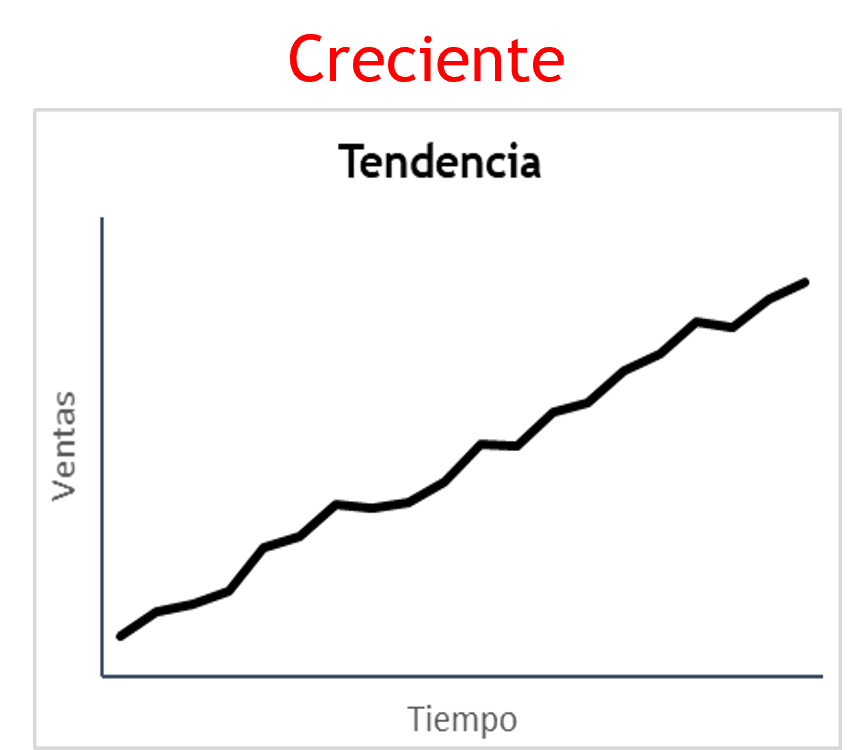{fig-align="center" width="200"}
:::

::: {.column width="33%"}
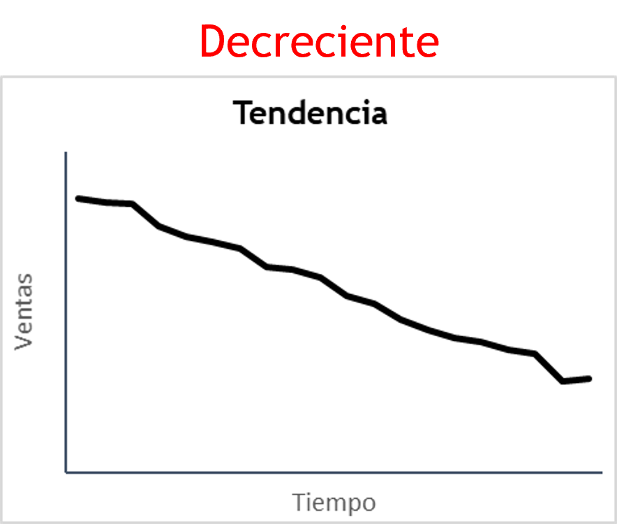{fig-align="center" width="200"}
:::

::: {.column width="33%"}
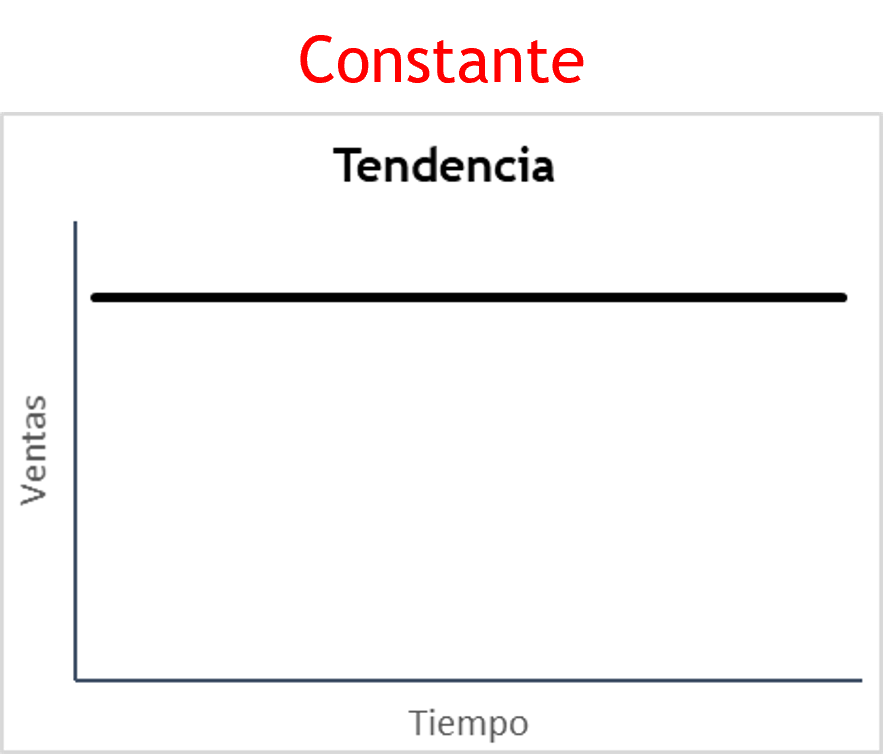{fig-align="center" width="200"}
:::
::::::

## Variaciones de Datos

::: incremental
-   Dichas métricas ayudan a identificar fluctuaciones en los datos.
-   Estas métricas pueden ser:
:::

:::::: columns
::: {.column width="20%"}
:::

:::: {.column width="80%"}
::: incremental
1.  Tasas de crecimiento: MoM, YoY, MTD, YTD.

2.  Estacionalidad.

3.  Estadística descriptiva.
:::
::::
::::::

## Segmentación Estratégica

::: incremental
-   El problema no está en el promedio.

-   Los datos globales ocultan información crítica.
:::

::: r-stack
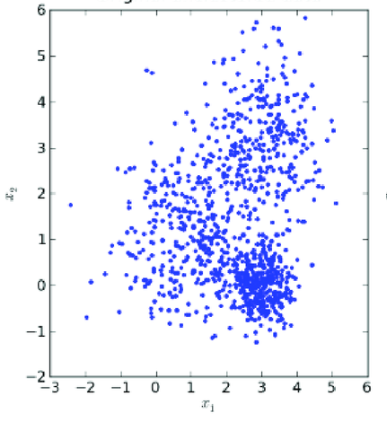{.fragment}

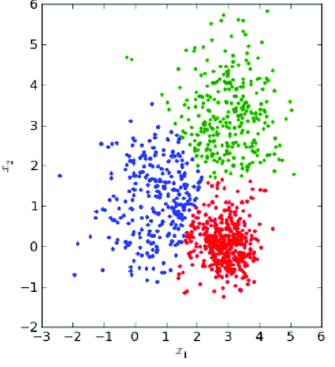{.fragment}
:::

## ¿Qué esta pasando? y ¿Por qué importa?

-   Todo análisis debe de responder las siguientes preguntas:

    ::: incremental
    -   ¿Qué está pasando?

    -   ¿Por qué está pasando?

    -   ¿A quién afecta?

    -   ¿Qué pasaría si no hacemos nada? / ¿Qué hacemos?
    :::

# [Visualización de Datos Efectiva.]{.seccion} {background-image="images/fondo_seccion.png"}

# "Una imagen vale más que mil palabras." {.center background-image="images/fondo_graficos.jpg" background-opacity="0.4"}

## ¿Importa la visualización de datos?

::: r-stack
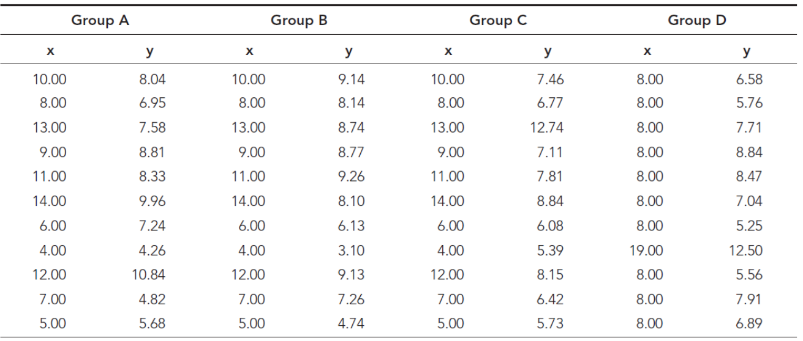{.fragment .fade-in-then-out}

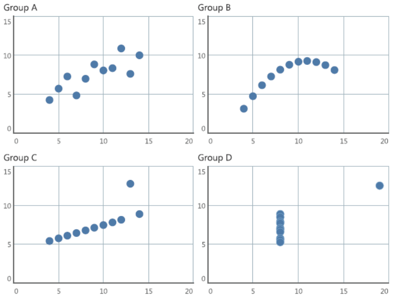{.fragment}
:::

## Principios para visualizaciones efectivas

 

#### Proximidad

Percibimos objetos cercanos como pertenencientes a un mismo grupo.

::::::: columns
:::: {.column width="50%"}
::: fragment
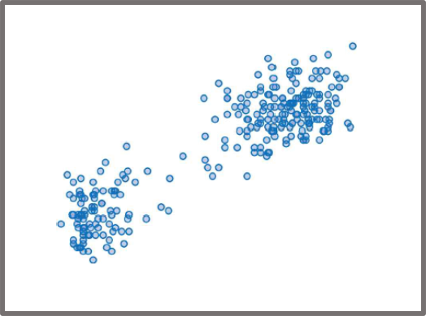
:::
::::

:::: {.column width="50%"}
::: fragment

:::
::::
:::::::

## Principios para visualizaciones efectivas

 

#### Similaridad

Objetos con similar color, forma, tamaño u orientación son percibidos como pertenecientes a un mismo grupo.

::::::: columns
:::: {.column width="50%"}
::: fragment
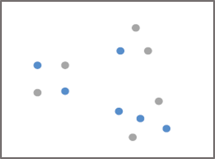
:::
::::

:::: {.column width="50%"}
::: fragment
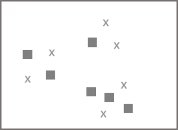
:::
::::
:::::::

## Principios para visualizaciones efectivas

 

#### Agrupamiento

Objetos que son limitados o encerrados por alguna figura o sombra son percibidos como pertenecientes a un mismo grupo.

::::::::: columns
:::: {.column width="33%"}
::: fragment
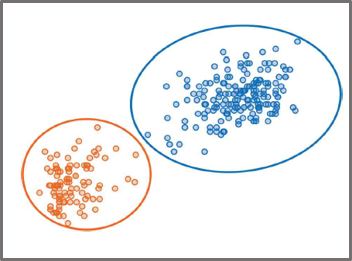
:::
::::

:::: {.column width="33%"}
::: fragment
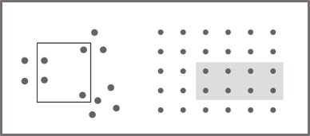
:::
::::

:::: {.column width="33%"}
::: fragment
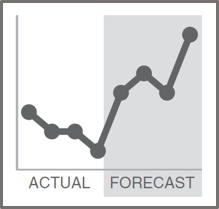
:::
::::
:::::::::

## Principios para visualizaciones efectivas

 

#### Concepto de Cierre

A las personas les gusta las cosas simples y lo ajustan a conceptos que ya existen o asimilan con facilidad.

::::::: columns
:::: {.column width="50%"}
::: fragment
{height="300"}
:::
::::

:::: {.column width="50%"}
::: fragment
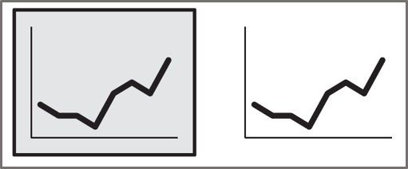
:::
::::
:::::::

## Principios para visualizaciones efectivas

 

#### Continuidad / Alineación

Objetos alineados o contínuos, que guardan un mismo eje, se perciben que pertenecen a un mismo grupo o que tienen igual característica.

::::: columns
:::: {.column width="100%"}
::: fragment
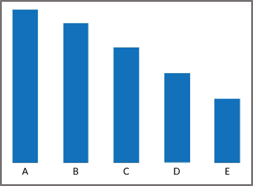{fig-align="center"}
:::
::::
:::::

## Principios para visualizaciones efectivas

 

#### Conexión

Objetos conectados se perciben como pertenecientes a un mismo grupo.

::::::: columns
:::: {.column width="50%"}
::: fragment
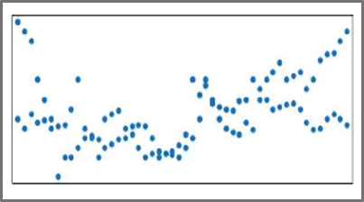
:::
::::

:::: {.column width="50%"}
::: fragment
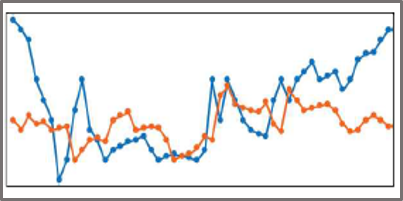
:::
::::
:::::::

## Color y Estética

 

#### Color

::: fragment
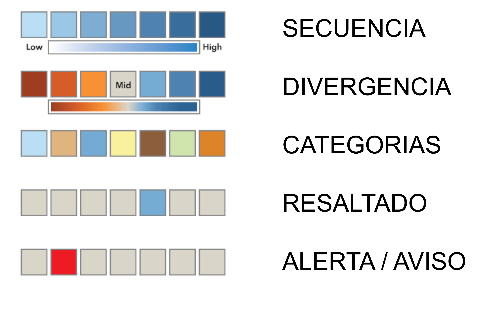{fig-align="center" height="450"}
:::

## Color y Estética {.smaller}

 

#### Estética

::::::::: columns
:::: {.column width="40%"}
::: fragment
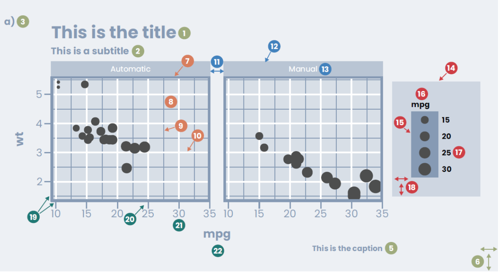
:::
::::

:::: {.column width="30%"}
::: {.fragment style="font-size: 0.8em;"}
1.  Título de gráfico

2.  Subtitulo de gráfico

3.  Etiqueta de gráfico

4.  Fondo de gráfico

5.  Pie de nota del gráfico

6.  Márgenes del gráfico

7.  Borde de panel gráfico

8.  Fondo de panel gráfico

9.  Cuadricula menor

10. Cuadrícula mayor

11. Espacio de panel
:::
::::

:::: {.column width="30%"}
::: {.fragment style="font-size: 0.8em;"}
12. Banda de panel

13. Título de panel

14. Fondo de leyenda

15. Marca/Key de leyenda

16. Título de leyenda

17. Texto de leyenda

18. Margen de leyenda

19. Líneas de eje

20. Marcas de eje

21. Texto de eje

22. Título de eje
:::
::::
:::::::::

## Objeto visual efectivo.

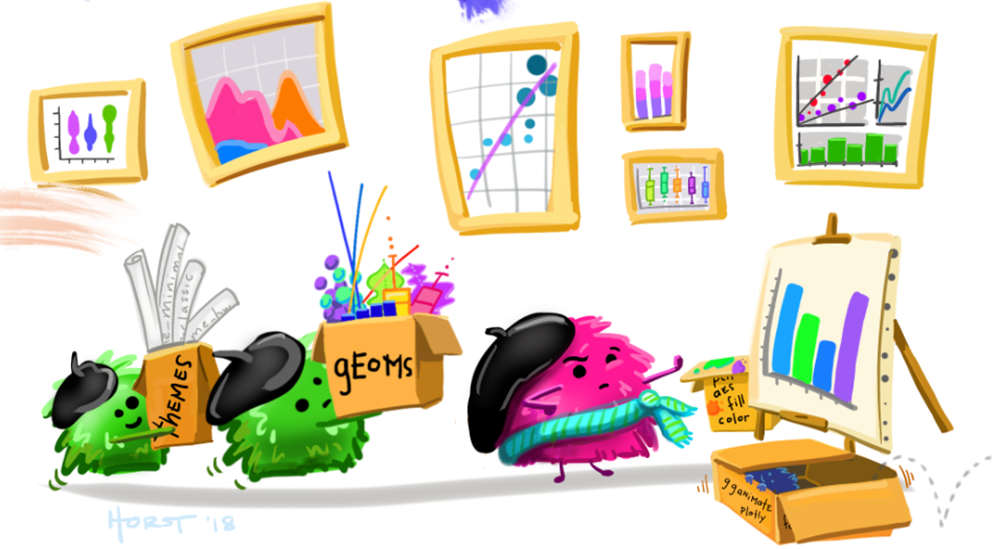{.fragment height="600"}

## Objeto visual efectivo.

::::::: columns
:::: {.column width="50%"}
::: fragment
-   Por tipo de input.

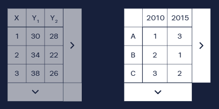
:::
::::

:::: {.column width="50%"}
::: fragment
-   Por la función que desempeña.

    ::: incremental
    -   Comparación

    -   Distribución

    -   Parte de un todo

    -   Correlación

    -   Tendencia con el tiempo
    :::
:::
::::
:::::::

## Recomendación para seleccionar visualización

:::::: columns
::::: {.column width="100%"}
::: fragment
-   [DataViz Project](https://datavizproject.com/){target="_blank" title="Clic para ir"}
:::

::: fragment
-   [Data to Viz](https://www.data-to-viz.com/){target="_blank" title="Clic para ir"}
:::
:::::
::::::

# [Taller]{.seccion} {background-image="images/fondo_seccion.png"}

#  {background-image="images/final.png"}
